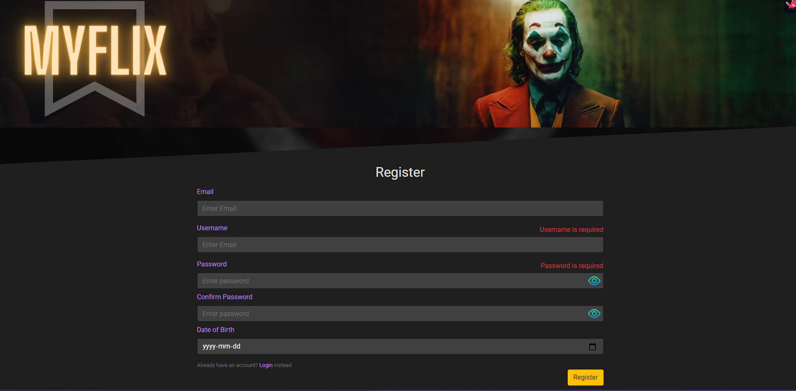

<div class='outer-container' style='width: 100%; margin-inline:auto;'>
  
  <p align="center" width="100%" id='top'>
    
  </p

  <div class='heading' style='width: 100%; display: flex; justify-content: center; font-weight: bold'>
    <h3>A minimal movie browsing app made for non-commercial use</h3>
  </div>

  <div class='badges-container' style='width: 100%; display: flex; justify-content: center; gap: 1rem'>

  

  [](./LICENSE)

  </div>

</div>

<details>
  <Summary>TABLE OF CONTENT</Summary>
  <ol>
    <li>
      <a href='#key-features'>Key Features</a>
    </li>
    <li>
      <a href='#built-with'>Built with</a>
    </li>
    <li>
      <a href='#getting-started'>Getting started</a>
      <ul>
        <li>
          <a href='#prerequisites'>Prerequisites</a>
        </li>
        <li>
          <a href='#installation'>Installation</a>
        </li>
      </ul>
    </li>
    <li><a href="#usage">Usage</a></li>
    <li><a href="#roadmap"/>Roadmap</li>
    <li><a href="#license">License</a></li>
    
  </ol>
</details>

## Key Features:

- Browse through a plethora of movies to find information about few of the greatest movies of all time
- Sort Movies by rating & release year
- Search for movies through genres
- Add movies to your favourites (or remove)
- Drop reviews and ratings on movies

### Built With

- [React.js](https://reactjs.org/)
- [React-Bootstrap](https://react-bootstrap.github.io/)
- [Axios](https://axios-http.com/)
- [Formik](https://formik.org/)
- [Moment.js](https://momentjs.com/)
- [Parcel](https://parceljs.org/)
- [ReactDOM](https://reactjs.org/docs/react-dom.html)
- [React-paginate](https://github.com/AdeleD/react-paginate#readme)
- [React-redux](https://react-redux.js.org/)
- [Redux](https://redux.js.org/)
- [Redux-persist](https://github.com/rt2zz/redux-persist#readme)
- [Redux-thunk](https://github.com/reduxjs/redux-thunk)
- [Swiper.js](https://swiperjs.com/)
- [Yup](https://github.com/jquense/yup)

<p align="right">(<a href="#top">back to top</a>)</p>

---

## Getting Started

### Prerequisites

- npm
  ```sh
  npm install npm@latest -g
  ```

### Installation

1. Clone the repo
   ```sh
   git clone https://github.com/AneeshSaravuKarekad/myflix-client.git
   ```
1. Install NPM packages
   ```sh
   npm install
   ```

<p align="right">(<a href="#top">back to top</a>)</p>

---

## Usage

1. Register to use the app:

- Note: You are allowed to use fake/random email address to register

  

2. Explore!

<p align="right">(<a href="#top">back to top</a>)</p>

---

## Roadmap

- [x] Add proptypes to verify the types of props used by the components

- [ ] Add an introductory About section on the login page.
- [ ] Add Pagination 
  - [ ] Genres page 
  - [ ] Favourites page

<p align="right">(<a href="#top">back to top</a>)</p>

## License

Distributed under the MIT License. See `LICENSE.txt` for more information.

<p align="right">(<a href="#top">back to top</a>)</p>
